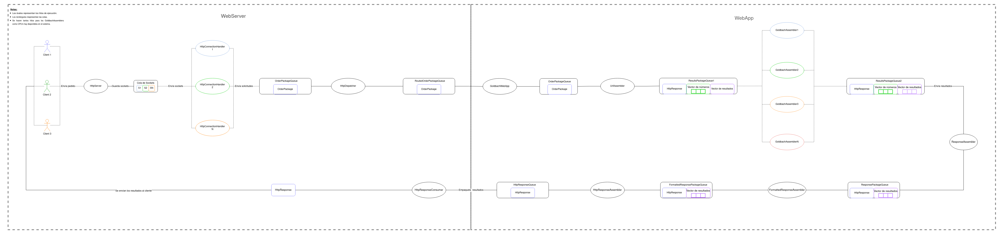
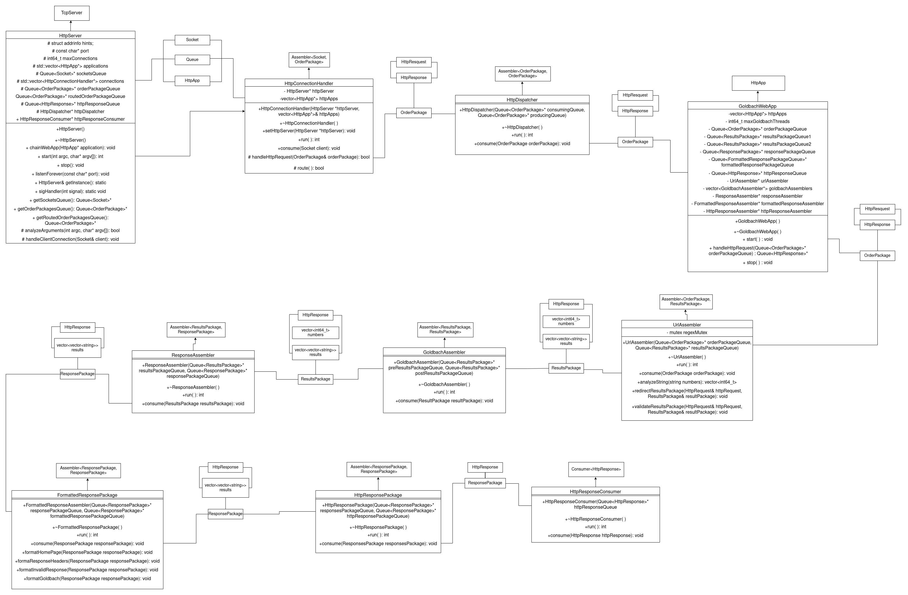

# **Web Server 1.2**

## Diseño e implementacion:

Para esta segunda etapa del proyecto, se nos pidió hacer dos cosas: hacer concurrente la aplicación web que calcula sumas de Godlbach, y crear una cadena de producción que utilice el patrón productor-consumidor durante todo el flujo del programa.

Nuestra cadena de producción quedó de la siguiente manera:

1. El HttpServer espera por conexiones de los clientes. Una vez fue recibida una solicitud, la coloca en una cola de sockets.
2. Los HttpConnectionHandler consumen sockets de esa cola de sockets, y producen un objeto encapsulador llamado OrderPackage en una cola llamada OrderPackageQueue. Dicho objeto encapsulador contiene el HttpRequest y el HttpResponse.
3. El HttpDispatcher consume OrderPackages de la cola OrderPackageQueue y produce otros OrderPackages en la cola RoutedOrderPackageQueue. Estos OrderPackages producidos van dirigidos a la aplicación web.
4. El GoldbachWebApp consume OrderPackages de RoutedOrderPackageQueue y coloca el OrderPackage en la cola OrderPackageQueue, a la vez que inicializa todos los hilos assemblers que operan en el dominio de la aplicación web.
5. El UrlAssembler consume OrderPackages de OrderPackageQueue, descompone el URL e identifica los números a trabajar, y produce un objeto encapsulador llamado ResultsPackage en ResultsPackageQueue1. Dicho objeto ResultsPackage contiene el HttpResponse, el vector de números solicitados por el cliente, y un vector donde irán los resultados de sacar las sumas de Goldbach de dichos números.
6. Los GoldbachAssembler consumen ResultsPackages de ResultsPackageQueue1, crea los hilos Goldbach y los corre. Dichos hilos Goldbach reciben el vector de números, crean hilos auxiliares llamados Solvers (para calcular concurrentemente los resultados) y retornan un vector de resultados. Finalmente, el GoldbachAssembler produce ResultPackages (ya con el vector de resultados lleno) en ResultsPackageQueue2.
7. El ResponseAssembler consume ResultPackages de ResultsPackageQueue2 y produce otro objeto encapsulador llamado ResponsePackage en la cola ResponsePackageQueue.
8. El FormattedResponseAssembler consume ResponsePackages de ResponsePackageQueue, le da el formato de impresión html y produce ResponsesPackages (ya con el formato) en FormattedResponsePackageQueue.
9. El HttpResponseAssembler consume ResponsesPackages de FormattedResponsePackageQueue y produce un HttpResponse en httpResponseQueue.
10. Por último, el HttpResponseConsumer consume HttpResponses de httpResponseQueue y ejecuta el método .send(), el cual envía los resultados al cliente y se los muestra en la página web de la aplicación.

Se puede ver esta cadena de producción de forma más gráfica en el siguiente diagrama de flujo: 

Asimismo, se cuenta con un diagrama UML que representa la utilización de las colas por parte de los hilos involucrados en el programa: 

## Créditos

Proyecto desarrollado por:

* Esteban Castañeda Blanco, correo: esteban.castaneda@ucr.ac.cr
* Daniel Lizano Morales, correo: daniel.lizanomorales@ucr.ac.cr
* Andrea Ramírez Rojas, correo: andrea.ramirezrojas@ucr.ac.cr
* Carlos Ramírez Masís, correo: carlos.ramirezmasis@ucr.ac.cr
